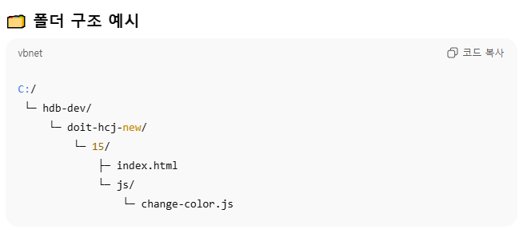

### ✅ 폴더 경로

같은 폴더 → "change-color.js"

하위 폴더 → "js/change-color.js"

상위 폴더 → "../change-color.js"

사이트 루트 → "/change-color.js"

윈도우 C:\ 경로 → HTML에 직접 쓰지 말고, 서버 돌리면 상대/절대 경로로 접근해야 함.

### 상위폴더 / 하위폴더 개념

ChatGPT의 말:

오케이 ✨ 상위폴더/하위폴더 개념을 파일 **위치(계층 구조)**로 이해하면 딱이야.

📌 용어

상위 폴더(Parent Folder)
지금 있는 폴더보다 한 단계 위의 폴더.
→ 15의 상위 폴더는 doit-hcj-new.

하위 폴더(Subfolder / Child Folder)
지금 있는 폴더 안에 들어있는 폴더.
→ 15의 하위 폴더는 js.

📌 경로 표현

같은 폴더

index.html에서 index.html 불러올 필요 없음 😆

같은 위치면 그냥 파일명만 써도 돼 → "index.html"

하위 폴더로 이동

index.html에서 js/change-color.js 로 접근

/는 “폴더 안으로 들어간다”라는 뜻

상위 폴더로 이동

../파일명 → 한 단계 위로 올라간다는 뜻

예: 15/js/index.html 파일에서 15/index.html을 불러오려면 → ../index.html

두 단계 이상 상위 폴더

../../파일명 → 두 단계 위로 이동

예: 15/js/abc/test.html → doit-hcj-new/index.html

../../index.html

👉 정리하면:

/ → 폴더 안으로 들어가기

.. → 한 단계 위(상위 폴더)로 올라가기